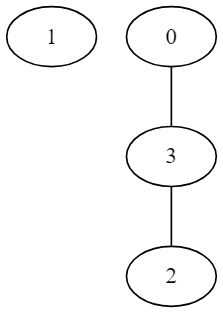

# Упражнение 9

## Graph

### Какво е граф?
* наредена двойка (V,E),където V e множество от върховете, а E e множество от ребра.
* Видове графи
	* ориентиран
	* неориентиран
	* цикличен
	* ацикличен
	* свързан
	* претеглен (тегловен)
	* пълен

### Начини на представяне
* Матрица на съседство
* Списък на наследниците
* Списък на ребрата

### Основни операции

* добавяне/премахване на връх
* добавяне/премахване на ребро
* проверка за съществуване на връх
* проверка за съществуване на ребро
* намиране на наследниците на даден връх

**!NB! сложността на всяка една от горните операции зависи от начина на представяне на графа**

[more information](https://en.wikipedia.org/wiki/Graph_(abstract_data_type))

### Обхождане на граф

* Търсене в дълбочинa
* Търсене в широчина

Пример: Нека разгледаме следния граф:


* Търсене в ширина :  1 2 3 5 4 6
* Търсене в дълбочина : 1 2 4 5 6 3

### Задачи:

1. Напишете функция convert(T,U), която конвертира представянето на ориентиран граф **G** от матрица на съседство(Т) в списък на съседите(U). За ваше улеснение напишете функции, които: 
	* да създават по въведено n матрица на съседство от n върха
	* да добавя ребро между два върха в матрицата // addEdge(T,v1,v2)
	* да печатат на стандартния изход матрицата на съседство
	* да печатат на стандартния изход списъка на съседите

2. Марио ви моли за помощ.Трябва да му помогнете да намери принцесата в объркания лабиринт. За тази цел по подадените координати на Марио и на принцесата ще трябва да му кажете дали има път до нея и какъв е той. Лабиринта се представя като матрица NxN, свободните клетки ги отбелязваме с ‘0’, а стените с ‘1’.

Пример:

0 0 0 0</br>
0 1 1 0</br>
0 1 1 0</br>
0 0 0 0</br>
Марио: (0,0)</br>
Принцесата: (3,3)</br>

Примерни решения:</br>
2 0 0 0    |    2 2 2 2 </br>
2 1 1 0    |    0 1 1 2 </br>
2 1 1 0    |    0 1 1 2 </br>
2 2 2 3    |    0 0 0 2 </br>

3. Намерете броя на върховете във всяка свързана компонента на неориентиран граф.
Графа ви е задеден във файл като върховете са номерирани от 0 до (броя на върховете на графа) - 1 по следният начин:
На първият ред на файла е зададен броят на върховете N на графа.
След това има N реда:
На i-тия ред е дадем броят на съседите на i-тия връх и след това индеклисите на неговите съседи.
Трябва да изпринтите в конзолата броят на върховете на всяка свързана компонента във графа без значение е реда в който ще го направите.

````
Пример:

Вход:
4 // N
1 3 //връх 0 има 1 съсед - връх 3
0 // връх 1 няма съседи
1 3 // връх 2 има 1 съсед - връх 3
2 0 2 // връх 3 има 2 съседа - връх 0 и връх 2

Примерен изход: (няма значение реда на принтене)
component 1 has 1 vertex
component 2 has 3 vertices

````

графа има вида: 



