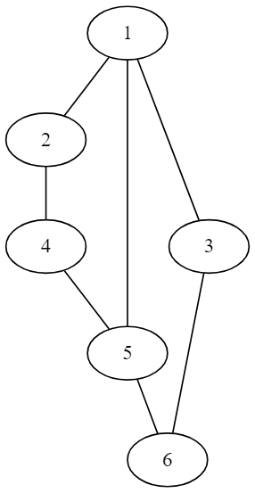

# Упражнение 9

## Graph

### Какво е граф?
* наредена двойка (V,E),където V e множество от върховете, а E e множество от ребра.
* Видове графи
	* ориентиран
	* неориентиран
	* цикличен
	* ацикличен
	* свързан
	* претеглен (тегловен)
	* пълен

### Начини на представяне
* Матрица на съседство
* Списък на наследниците
* Списък на ребрата

### Основни операции

* добавяне/премахване на връх
* добавяне/премахване на ребро
* проверка за съществуване на връх
* проверка за съществуване на ребро
* намиране на наследниците на даден връх

**!NB! сложността на всяка една от горните операции зависи от начина на представяне на графа**

[more information](https://en.wikipedia.org/wiki/Graph_(abstract_data_type))

### Обхождане на граф

* Търсене в дълбочинa
* Търсене в широчина

Пример: Нека разгледаме следния граф:

* Търсене в ширина :  1 2 3 5 4 6
* Търсене в дълбочина : 1 2 4 5 6 3
