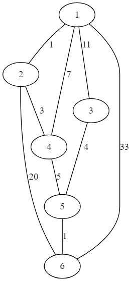

# Упражнение 11

## Algorithms in graph

#### Минимално покриващо дърво

* алгоритъм на Прим

* алгоритъм на Крускал

#### Намиране на най-къс път

* Алгоритъм на Дийкстра 
	
	* намира път от даден връх до всички върхове в графа/може да се модифицира до конкретен връх 
	* допуска само положителни стойности на ребрата
	
	* прилага се върху ориентирани и неориентирани графи
	

* Алгоритъм на Белман-Форд
	
	* намира път от даден връх до всички останали върхове
	
	* допуска отрицателни и положителни стойности на ребрата
	
	* прилага се най-често върху ориентирани графи	

* Алгоритъм на Флойд-Уоршал
	
	* намира най-къс между всички двойки върхове
	
	* допуска отрицателни и положителни стойности на ребрата
	
	* прилага се най-често върху ориентирани графи	

Задачи:
	1. Напишете функция path(G,start), която по подаден тегловен граф* и начален връх, връща вектор от най-късите пътища между началния връх(start) и всички останали върхове.
	

 *тегловния граф се състои само от положителни стойности на ребрата

 *вие сами изберете начина на представяне на графа
    
    
Пример: 
 

 		
          
Изход: [1, 11, 4, 9, 10]

